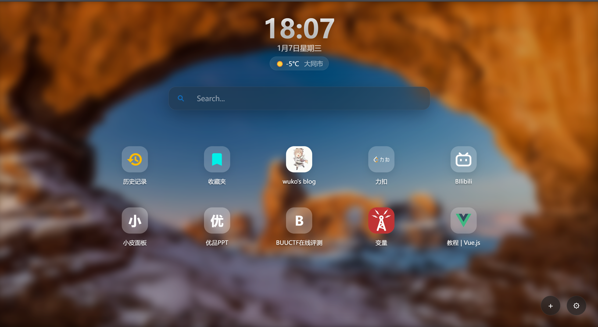

# 🚀 NueTab - 极简且强大的 Chrome 新标签页扩展

**NueTab** 是一款专注于美观、性能与高度可定制化的 Chrome 新标签页扩展。它摒弃了繁杂的信息流，还原标签页最纯粹的导航功能，同时提供强大的个性化配置。

> 此项目98％内容由AI生成，本人仅做bug处理与部分功能添加修改

## ✨ 核心特性

*   **🎨 高度可定制主题**：支持纯色、渐变、必应每日壁纸、自定义图片甚至**视频**作为背景。支持“毛玻璃 (Glassmorphism)”特效。

*   **🖱️ 自由拖拽布局**：
    *   主页图标支持任意拖拽排序。
    *   **新增**：拖拽图标至顶部“红色回收站”区域即可快速删除。
    *   支持将图标在“主页”与“应用库”之间拖拽移动。

*   **🔍 智能搜索**：内置百度、Google、Bing 引擎，支持**实时搜索建议 (联想词)**。

*   **📂 应用抽屉 (App Drawer)**：底部上滑或点击展开应用库，支持分类管理，保持主页整洁。

*   **⚡ 侧边栏助手**：右侧滑出侧边栏，快速访问**历史记录**与**书签**，无需跳转页面。

*   **☁️ 实时天气**：基于 Open-Meteo 的精准天气显示，自动定位或手动设置城市。

*   **🔒 隐私优先**：所有配置数据存储在本地 (Local Storage / IndexedDB)，不收集任何用户隐私。

## 🛠️ 安装指南

由于目前尚未发布到 Chrome Web Store，请通过“开发者模式”安装：

1.  **下载代码**：
    *   点击右上角的 `Code` -> `Download ZIP` 并解压。
    *   或者使用 Git 克隆：`git clone https://github.com/wuko233/nuetab.git`

2.  **打开扩展管理**：
    *   在 Chrome 浏览器地址栏输入 `chrome://extensions/`。

3.  **开启开发者模式**：
    *   打开页面右上角的“开发者模式”开关。

4.  **加载扩展**：
    *   点击左上角的“加载已解压的扩展程序”。
    *   选择你解压后的 `nuetab` 文件夹。

5.  **完成！** 打开一个新的标签页即可体验。

## ⚙️ 配置说明

点击页面右下角的 **⚙ (设置)** 按钮即可进入强大的配置面板：
*   **常规**：链接打开方式、天气城市、分类管理。
*   **布局**：调整图标大小、间距、圆角、网格列数。
*   **样式**：切换深色/浅色/毛玻璃模式，自定义字体颜色。
*   **数据**：导入/导出配置，清理缓存。

## 🤝 贡献与反馈

欢迎提交 Issue 反馈 Bug 或建议新功能。如果你喜欢这个项目，请点亮 ⭐ Star！

---
**Version 1.0 Update Notes:**
*   修复了 CSP 内容安全策略导致的搜索建议失效问题。
*   新增了直观的拖拽删除交互。
*   优化了 UI 细节与性能。
